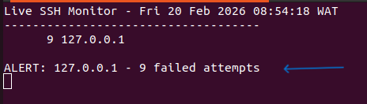

# Linux SSH Brute Force Monitoring & Automation

🔐 Project Overview
This project demonstrates detection and automation of SSH brute-force login attempts on a Linux system using:
	•	Bash scripting
	•	Log analysis
	•	Real-time monitoring
	•	Cron job automation
  
  🧪 Phase 1 – Log Analysis
  Analyzed: /var/log/auth.log 
  Used: grep "Failed password" /var/log/auth.log
  Extracted source IP addresses and counted  failed login attempts.
  
 🔄 Phase 2 – Live Monitoring
 Built a continuous monitoring loop that:
	•	Parses SSH failed logins
	•	Counts failed attempts per IP
	•	Triggers alert when attempts ≥ 3
	•	Displays real-time updates
  ### 📸 Live Monitoring
  
  
  ### 🚨 Alert Escalation
  
  
  ### ⏱ Cron Automation
  Configured scheduled detection: */5 * * * * /home/ugoo/ssh_bruteforce_detector.sh >> /home/ugoo/cron_log.txt 2>&1
  📸 Cron Configuration
  

### 📄 Execution Logs
 Verified automated execution: cat /home/ugoo/cron_log.txt
 📸 Cron Log Output

### 📊 Generated Security Report
Script produces structured detection report: cat /home/ugoo/ssh_security_report.txt
📸 Security Report Output

🛠 Skills Demonstrated
	•	Linux log analysis
	•	Bash scripting
	•	Regex filtering
	•	Security monitoring
	•	Cron automation
	•	Incident simulation
	•	Detection engineering fundamentals

  🚀 Future Improvements
	•	Log forwarding to SIEM
	•	Integration with Wazuh
	•	Alert email notification
	•	IP blocking automation

  
